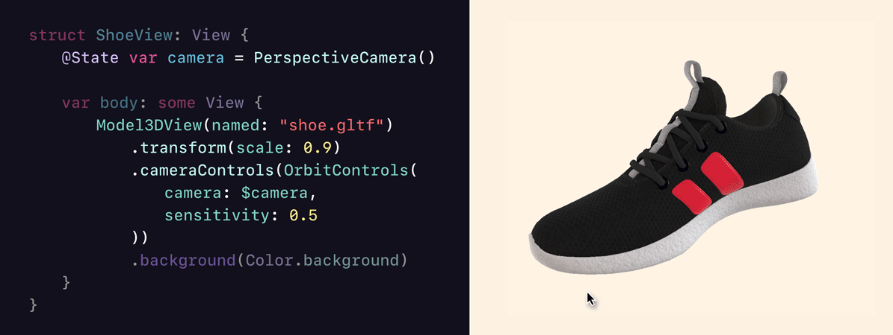

> Effortlessly render 3D models in your SwiftUI app


[](https://developer.apple.com/xcode/swiftui)
[](https://swift.org)
[](https://developer.apple.com/xcode)
[](https://opensource.org/licenses/MIT)

With *Model3DView* you can effortlessly display 3D models in your SwiftUI app just like you would with images. Additionally you can manipulate the camera and transform the model, all while keeping things SwiftUI-friendly.

⚠️ ***IMPORTANT***: *Model3DView* is still in very early stages of development. The API is not final and ~~may~~ will change over the course of upcoming version releases.

<br>



<br>

## Index
* [Examples](https://github.com/frzi/Model3DView-Examples) ↗️
* [Features](#features-)
* [Installation](#installation-)
* [Quickstart](#quickstart-)
* [FAQ](#faq-)
* [Known issues](#known-issues-)
* [Thanks](#thanks-)
* [License](#license-)

<br>

## Examples

[](https://github.com/frzi/Model3DView-Examples)
* [Model3DView-Examples](https://github.com/frzi/Model3DView-Examples) contains:  
  ┗ [FancyIntroduction](https://github.com/frzi/Model3DView-Examples/tree/main/FancyIntroduction)  
  ┗ [Panorama viewer](https://github.com/frzi/Model3DView-Examples/tree/main/Panoramic)  
  
<br>

## Features ✨

* **glTF support!**  
  *Model3DView* supports loading and rendering glTF models right out of the box.

* **Skyboxes and IBL (image based lighting)**  
  Does your model use PBR materials? Change the global lighting by setting an IBL image. (*OpenEXR files supported!*)

* **Interactive camera controls**  
  Let users interact with your model by moving the camera. *Model3DView* comes with *OrbitControls* (aka arcball) that will take care of this.

<br>

## Installation 🛠
In Xcode add the dependency to your project via *File > Add Packages > Search or Enter Package URL* and use the following url:
```
https://github.com/frzi/Model3DView.git
```

Once added, import the package in your code:
```swift
import Model3DView
```
*If Xcode throws errors while resolving dependencies, you can temporarily link to the `main` branch, opposed to using a tagged version.*

<br>

## Quickstart 🚀
The code is provided with ample documentation, including [DocC](Sources/Model3DView/Model3DView.docc). For detailed information about views, methods, etc, please use Xcode's documentation features.

Below a quick rundown of *Model3DView*'s features.

Using *Model3DView* couldn't possibly be more easy. Use the `Model3DView` like any other view:
```swift
import Model3DView

struct MyView: View {
	var body: some View {
		Model3DView(named: "duck.gltf")
	}
}
```
This renders a 3D model with the filename "*duck.gltf*" that's located in the app's bundle.

### `Model3DView`

#### Transform
```swift
Model3DView(named: "house.glb")
	.transform(
		rotate: Euler(y: .degrees(45)),
		scale: 1.2,
		transform: [0, 0, -1]
	)
```
Rotate, scale and/or translate the 3D asset, relative to its origin. These properties are animatable!

#### `onLoad` handler
```swift
Model3DView(file: model.path)
	.onLoad { state in
		self.modelLoaded = state == .success
	}
```
For performance and UX reasons, 3D assets are loaded asynchronously. Use the `.onLoad` view modifier to attach a listener when the assets have fully loaded. This gives you the opportunity to place a temporary placeholder over the `Model3DView`.

<br>

### Cameras
If the default camera is not to your liking you can just as easily set your own camera.
```swift
Model3DView(named: "robot.gltf")
	.camera(PerspectiveCamera(fov: .degrees(75)))
```
The available camera types are `PerspectiveCamera` and `OrthographicCamera`.

<br>

### Interactive cameras
To ease the burden of doing the hard work yourself, *Model3DView* comes with interactive camera controls support. As of now the only included camera controls are `OrbitControls` (also known as "arcball").
```swift
@State var camera = PerspectiveCamera()

Model3DView(named: "garden.obj")
	.cameraControls(OrbitControls(
		camera: $camera,
		sensitivity: 0.5,
		friction: 0.1
	))
```

<br>

### Skybox and IBL (image based lighting)
*Model3DView* does not allow you to place lights in the scenery. Instead you can set the mood by using environment maps and the skybox texture. 
```swift
Model3DView(file: product.path)
	.ibl(named: "studio_env.exr", intensity: 2)
	.skybox(named: "studio.jpg")
```

*Note: IBL only affects assets using a PBR material.*

<br>

## FAQ ✋
### Can I use this to make 3D games?
***No***. It is very important to understand *Model3DView* is made to only render 3D models in your SwiftUI app, with very limited interaction. It's nothing more than an 'ImageView' to easily spruce up your app with 3D graphics.

### Why use *Model3DView* instead of *SceneView*?  
*SceneView* (included with SwiftUI) is very limited in its nature. It simply wraps a `SKSceneView` for SwiftUI. But due to it being closed source gives no control on this view. For instance: giving the view a transparent background is practically impossible. 

*Model3DView* also provides a workflow more inline with SwiftUI's ecosystem; using view modifiers to manipulate the model and camera.

<br>

## Known issues 💢
* Animating cameras using SwiftUI's animation model is still very wonky.
* Lackluster error handling when a model fails to load.
* Depending on the asset's origin, they may not be centered correctly by default.

<br>

## Thanks 🙇
* [GLTFSceneKit](https://github.com/magicien/GLTFSceneKit) - This project wouldn't be half as interesting if it didn't have glTF support.
* [DisplayLink](https://github.com/timdonnelly/DisplayLink) - A wrapper around `DisplayLink` for SwiftUI.

<br>

## License 📄
[MIT License](LICENSE).
